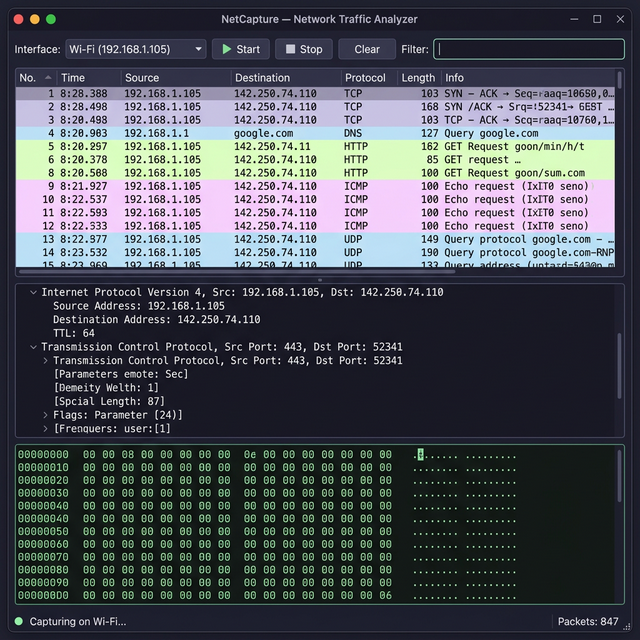

# 🦈 NetCapture — Network Traffic Analyzer

A lightweight **Wireshark-like** network traffic capture and analysis tool built entirely in **C# / WPF** with **zero external native dependencies**.


<p align="center">
  
</p>

## ✨ Features

- **Real-time packet capture** via Windows Raw Sockets (`SIO_RCVALL`) — no Npcap/WinPcap needed
- **Protocol dissection** — IPv4/IPv6, TCP, UDP, ICMP/ICMPv6, IGMP, DNS, mDNS, DHCP, SSDP, HTTP, TLS (with handshake details)
- **Three-panel Wireshark-style layout:**
  - 📋 Packet list with color-coded protocol rows
  - 🌳 Packet detail tree (expandable header dissection by layer)
  - 🔢 Hex dump view (offset + hex + ASCII)
- **Live filtering** — filter by protocol, IP address, port, or any text
- **Interface selector** — choose from active network adapters
- **Dark theme** — Catppuccin Mocha color scheme

## 🚀 Getting Started

### Prerequisites

- [.NET 8 SDK](https://dotnet.microsoft.com/download/dotnet/8.0) or later
- Windows 10/11
- **Administrator privileges** (required for raw socket access)

### Build & Run

```powershell
git clone https://github.com/Aliowa/net-trafic-capture.git
cd net-trafic-capture
dotnet run
```

> ⚠️ **Must be run as Administrator** — Windows requires elevated privileges for raw socket packet capture.

## 🎯 Usage

1. **Select a network interface** from the dropdown
2. Click **▶ Start** to begin capturing packets
3. **Click any packet** to see detailed protocol headers and hex dump
4. Use the **Filter** field to narrow results (e.g., `tcp`, `dns`, `192.168.1.1`, `443`)
5. Click **⏹ Stop** to end capture, **🗑 Clear** to reset

## 🏗️ Architecture

```
NetCapture/
├── Models/
│   ├── CapturedPacket.cs          # Packet data model
│   └── PacketDetailNode.cs        # Tree node for protocol details
├── Services/
│   ├── PacketCaptureService.cs    # Raw socket capture engine
│   └── PacketParser.cs            # Manual protocol dissector
├── ViewModels/
│   └── MainViewModel.cs           # MVVM ViewModel
├── Converters/
│   ├── HexDumpConverter.cs        # Byte[] → hex dump display
│   ├── ProtocolColorConverter.cs  # Protocol → row color
│   └── UtilityConverters.cs       # Bool/null converters
├── MainWindow.xaml                # WPF UI layout
├── MainWindow.xaml.cs
├── App.xaml
└── App.xaml.cs
```

## 📡 Supported Protocols

| Layer       | Protocols                          |
|-------------|------------------------------------|
| Network     | IPv4, IPv6, ICMP, ICMPv6, IGMP    |
| Transport   | TCP, UDP                           |
| Application | DNS, mDNS, HTTP, TLS, DHCP, SSDP  |

## 🛠️ Tech Stack

- **.NET 8** — runtime
- **WPF** — desktop UI framework
- **CommunityToolkit.Mvvm** — MVVM pattern
- **Windows Raw Sockets** — packet capture (no Npcap!)

## 📝 License

MIT License — see [LICENSE](LICENSE) for details.
